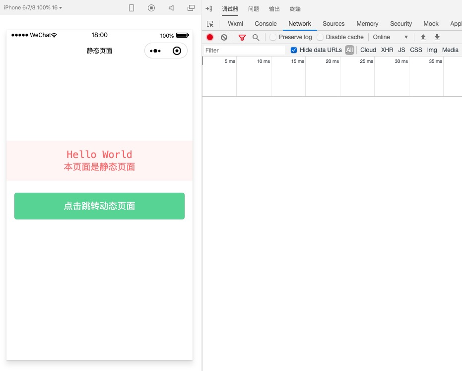
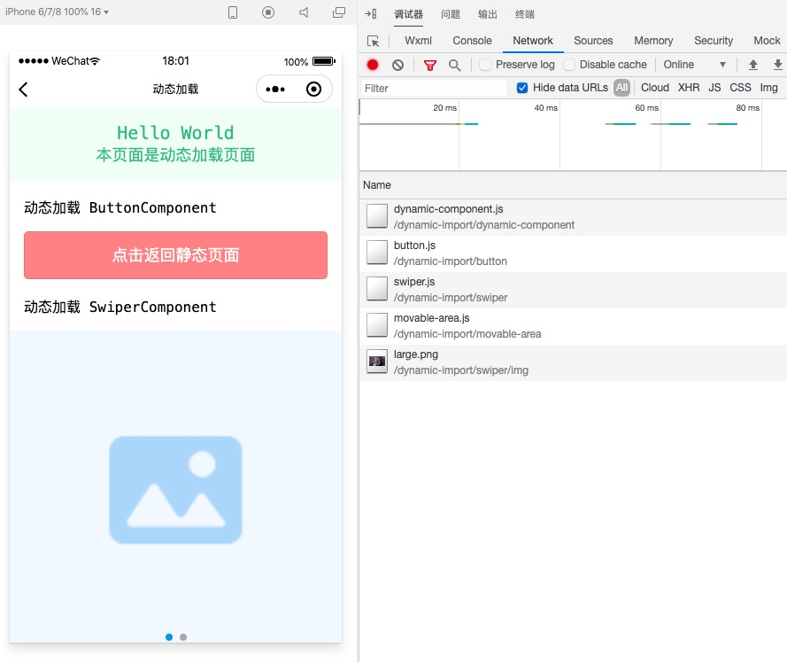

# taro-dynamic-import-weapp

> 基于 Taro 3.0 的小程序端动态加载逻辑

## 如何使用

见 [taro-plugin-dynamic-import-weapp](./packages/taro-plugin-dynamic-import-weapp/README.md)

## 基本原理

在 `Taro 3.0` 的 `webpack` 打包能力和 `react` 的运行时能力基础上, 使用 `webpack 插件` 和 `babel 插件` 的情况下, 结合 `dynamic-import`, `wx.request`, `eval5` 来实现打包动态加载的代码的情况下, 不影响静态资源的逻辑

## 运行 demo

建议 node 版本 `12.x`

```bash
# 项目根目录安装依赖
yarn

# 打包 demo 项目, 默认开发端口是 5000
npm run start
```

项目运行后,

- 打开小程序开发者工具, 可以看到动态请求的 js 代码
- 可以修改 `packages/demo/src/dynamic-import` 项目中的代码, 对比打包结果

### 预览图

**静态页面示例图:**


**动态页面示例图:**


## 缺点

- 有可能不支持 `webpack 5.0+`
- 不支持动态加载样式文件 `wxss`, 建议使用原子性的 CSS 库 `tailwind CSS`
